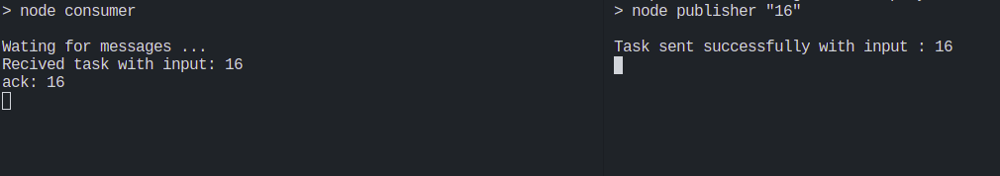

# Play with RabbitMQ 

*Make task handler using node.js and RabbitQM server*

# How to play with it  ?

## First, make sure that you have installed node.js and the RabbitMQ server is running


## Then, open terminal and run command

``` $ npm install ```

*To intall all required packages*

## Then, run command 

``` $ npm run consume ```

*It will stay alive and wating for upcoming message*

## Finally, open another terminal an run command 

``` $ npm run publish 20 ```

*It will send new message.*

# Screenshot

